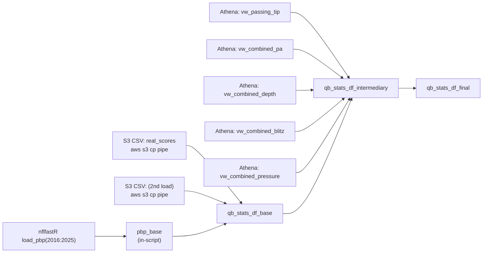
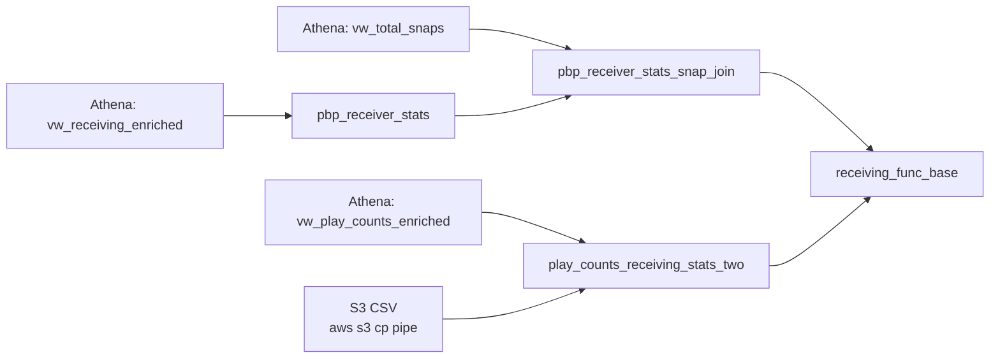
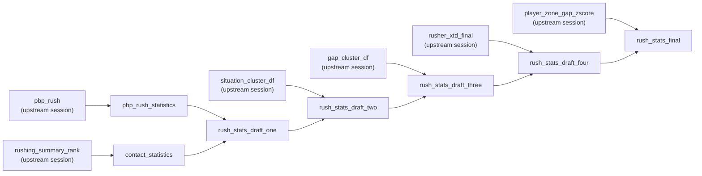
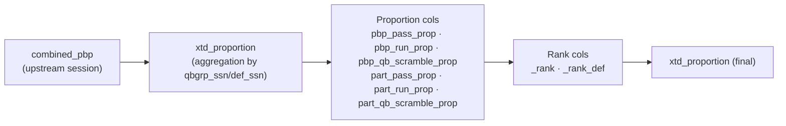

> **Rule:** Only code-verified joins, transforms, and loads are documented. No assumptions.
> **Source:** Extracted directly from R scripts via PowerShell pattern scan.
> **Last updated:** `r Sys.Date()`

---

## Pipeline Overview

```
data_build/   ->  pbp_base, part_nfl, combined_pbp
pff_stats/    ->  qb_stats_df_final, receiving_func_base, rush_stats_final
model_funcs/  ->  11 XGBoost wrappers (cp, plays, rec, rush, sack, scr,
                   tds, twp, xpass, xtd_proportion, ypa)
```

---

## Tier 1: Production Dataframes

### `qb_stats_df_final`

- **Created in:** `pff_stats/qb_stats_df_build_AWS.R`
- **Feeds into (11 model funcs):** `cp_func_AWS.R`, `plays_func_AWS.R`, `rec_func_AWS.R`, `rush_func_AWS.R`, `sack_func_AWS.R`, `scr_func_AWS.R`, `tds_func_AWS.R`, `twp_func_AWS.R`, `xpass_func_AWS.R`, `xtd_proportion_func_AWS.R`, `ypa_func_AWS.R`

**Upstream Inputs (verified from code scan):**



**Verified Joins:**

```r
qb_stats_df_base <- left_join(qb_stats_df_base, real_scores,
                              by = c("posteam", "week", "season"))
qb_stats_df_intermediary <- left_join(qb_stats_df_base, ...)
qb_stats_df_intermediary <- left_join(qb_stats_df_intermediary, ...)
qb_stats_df_intermediary <- left_join(qb_stats_df_intermediary, ...)
qb_stats_df_intermediary <- left_join(qb_stats_df_intermediary, ...)
```

**Verified Transforms:**

```r
pbp_base$td_side <- ifelse((!is.na(pbp_base$td_team) &
                            pbp_base$posteam == pbp_base$td_team), 1, 0)

# Playoff week remap (pre-2020 vs post-2020 season structure)
pbp_base$week <- ifelse(pbp_base$week == 18 & pbp_base$season <= 2020, 28, pbp_base$week)
pbp_base$week <- ifelse(pbp_base$week == 19 & pbp_base$season <= 2020, 29, pbp_base$week)
pbp_base$week <- ifelse(pbp_base$week == 19 & pbp_base$season >  2020, 28, pbp_base$week)
pbp_base$week <- ifelse(pbp_base$week == 20 & pbp_base$season <= 2020, 30, pbp_base$week)
pbp_base$week <- ifelse(pbp_base$week == 20 & pbp_base$season >  2020, 29, pbp_base$week)
pbp_base$week <- ifelse(pbp_base$week == 21 & pbp_base$season <= 2020, 32, pbp_base$week)
pbp_base$week <- ifelse(pbp_base$week == 21 & pbp_base$season >  2020, 30, pbp_base$week)
```

**Verified Data Loads:**

```r
read.csv(pipe(sprintf('aws s3 cp %s -', s3_path)))
read.csv(pipe(sprintf('aws s3 cp %s -', s3_path)))
```

**Breakage Points:**

- `real_scores` schema change -> first join fails or drops rows silently
- S3 path format change -> `aws s3 cp` pipe breaks
- Week-remap assumes NFL season structure (pre/post 2020 cutoff); format change breaks all downstream weekly aggregation

---

### `receiving_func_base`

- **Created in:** `pff_stats/receiving_stats_build_AWS.R`
- **Feeds into:** `rec_func_AWS.R`

**Upstream Inputs (verified from code scan):**



**Verified Joins:**

```r
pbp_receiver_stats_snap_join <- left_join(pbp_receiver_stats, ...)
pbp_receiver_stats_final     <- left_join(pbp_receiver_stats_snap_join, ...)
play_counts_receiving_stats_two <- left_join(vw_play_counts %>% ..., ...)
play_counts_receiving_stats_two <- left_join(play_counts_receiving_stats_two, ...)
```

**Verified Transforms:**

```r
final_position_group = case_when(...)
part_rec_xtds        = case_when(...)
part_xtds_share      = case_when(...)
# + additional mutate() blocks (see script for full body)
```

**Verified Data Loads:**

```r
read.csv(pipe(sprintf('aws s3 cp %s -', s3_path)))
```

**Breakage Points:**

- `vw_play_counts` Athena view rename -> join fails
- Position group logic changes -> `case_when` branches silently mis-classify

---

### `rush_stats_final`

- **Created in:** `pff_stats/pff_rushing_stats_build_six_final.R`
- **Feeds into:** `rush_func_AWS.R`

**Upstream Inputs (verified from code scan):**



> Note: This script operates on DFs loaded into the R session by upstream build scripts (clustering + base PBP pipelines). See corresponding build scripts in `df_builds/` and `data_build/`.

**Verified Joins (5-stage chain):**

```r
rush_stats_draft_one   <- left_join(pbp_rush_statistics, ...)
rush_stats_draft_two   <- left_join(rush_stats_draft_one, ...)
rush_stats_draft_three <- left_join(rush_stats_draft_two, ...)
rush_stats_draft_four  <- left_join(rush_stats_draft_three, ...)
rush_stats_final       <- left_join(rush_stats_draft_four, ...)
```

**Verified Transforms:**

```r
mutate(yards_before_contact = yards - yards_after_contact)
# + additional mutate() block (see script for full body)
```

**Verified Data Loads:** None detected in scan (inherits from upstream).

**Breakage Points:**

- Any column rename upstream of `pbp_rush_statistics` -> breaks the 5-stage chain
- Missing `yards_after_contact` -> `yards_before_contact` becomes NA

---

### `xtd_proportion`

- **Created in:** `model_funcs/xtd_proportion_func_AWS.R`
- **Feeds into:** Scoring wrappers

**Upstream Inputs (verified from code scan):**



**Verified Joins:** None detected in scan (operates on pre-joined input).

**Verified Transforms:**

```r
wind_na     = ifelse(is.na(wind), 0, wind)
weather     = case_when(...)
comp_bucket = case_when(...)
anova_sig   = case_when(...)
# + additional mutate() blocks (see script for full body)
```

**Verified Data Loads:** None detected in scan.

**Breakage Points:**

- Weather field schema change (`wind`) -> `wind_na` fallback breaks
- `case_when` bucket boundary changes -> shifts downstream scoring output

---

## Maintenance

- Change logic -> re-run the PowerShell extraction scan -> update the affected section here -> commit.
- Never document a transform that is not in the extracted output.
- When a new `case_when` / join / data load shows up in a scan, add it under the correct DF; do not infer intent.


# nflmodels

NFL play-level modeling pipeline. Ingests play-by-play and PFF data, engineers features, and trains 11 XGBoost models used as inputs to manual, team-specific prediction work.
