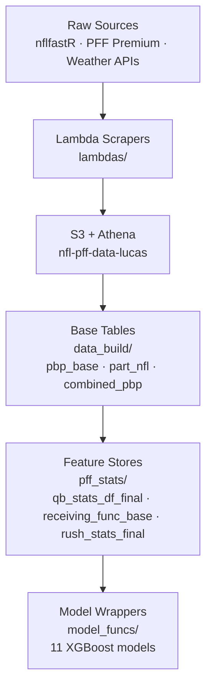

# NFL Models

NFL analytics and prediction system for betting/projection analysis. Combines play-by-play data (nflreadr/nflfastR), PFF participation data, and PFF player-level statistics.

## Architecture



See [`Lineage One.Rmd`](./Lineage%20One.Rmd) for per-dataframe lineage with verified joins and transforms.

---

## Structure

- `data_build/` — Base data pipelines: pbp_nfl_base, part_nfl_base, combined joins, IDs
- `participation_models/` — XGBoost models using PFF participation data
- `pbp_models/` — XGBoost models using play-by-play only (no participation)
- `df_builds/` — Defensive scheme dataframes (blitz/depth/less/pressure, off/def)
- `pff_stats/` — PFF stat aggregations: receiving, rushing, blocking, coverage, QB
- `model_funcs/` — Prediction functions (cp, ypa, sack, scramble, xpass, tds, etc.)
- `util/` — Helper scripts, normalization, package management
- `exploration/` — One-off analysis, comparisons, weather exploration
- `archive/` — Deprecated files kept for reference

## Critical: XGBoost Version Requirements

**Pin to xgboost 1.7.11.1 + mlr3learners 0.13.0**

Newer xgboost 2.x breaks everything:
- `eta` → `learning_rate`
- `gamma` → `min_split_loss`
- `watchlist` → `evals`
- `xgboost()` → `xgb.train()`

**Always use `xgb.train()` with explicit params list:**
```r
params <- list(
  objective = "binary:logistic",
  eval_metric = "logloss",
  eta = 0.05,
  max_depth = 6,
  # ... etc
)

model <- xgb.train(
  params = params,
  data = dtrain,
  nrounds = 1000,
  watchlist = list(train = dtrain, test = dtest),  # NOT evals
  early_stopping_rounds = 50
)
```

**Save feature names with models** — XGBoost doesn't store them. Always write a companion `_features.txt` or `_artifacts.rds` to S3.

## R Package Installation (Ubuntu EC2)

Use Posit Package Manager for pre-compiled binaries:
```r
options(repos = c(CRAN = "https://packagemanager.posit.co/cran/__linux__/noble/latest"))
```

Without this, packages compile from source (hours).

## AWS Infrastructure

- **S3 bucket:** `nfl-pff-data-lucas`
- **Athena database:** `nfl_data`
- **Workspaces:** Transfer via `s3://nfl-pff-data-lucas/workspaces/`

### Athena gotchas

- `DROP TABLE` only removes metadata, not S3 files
- CTAS appends files, doesn't overwrite — delete S3 prefix first
- Game ID column is `nflverse_game_id` (not `game_id`)

## Long-running jobs

Use `screen`, `tmux`, or `nohup` to prevent loss from browser/SSM timeout:
```bash
nohup Rscript my_script.R > output.log 2>&1 &
```

## File transfers (SSM → RStudio)

Files downloaded to `/home/ssm-user/` need to be copied:
```bash
sudo cp /home/ssm-user/file.rds /home/ubuntu/
sudo chmod 644 /home/ubuntu/file.rds
```
